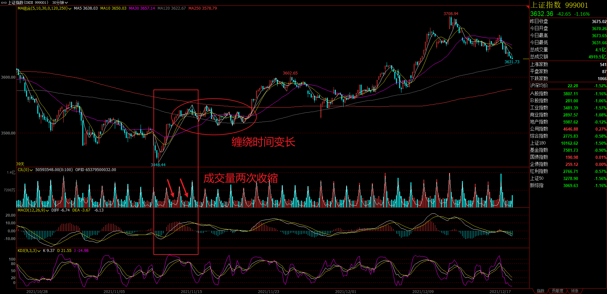
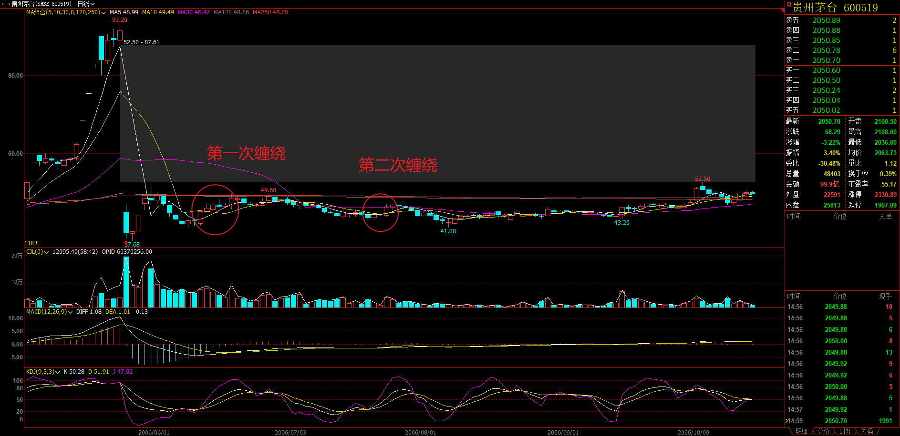
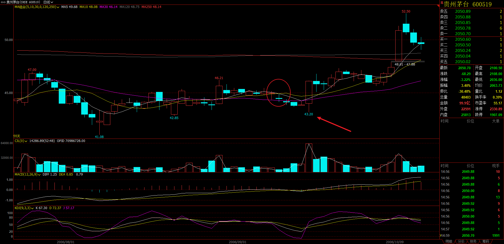
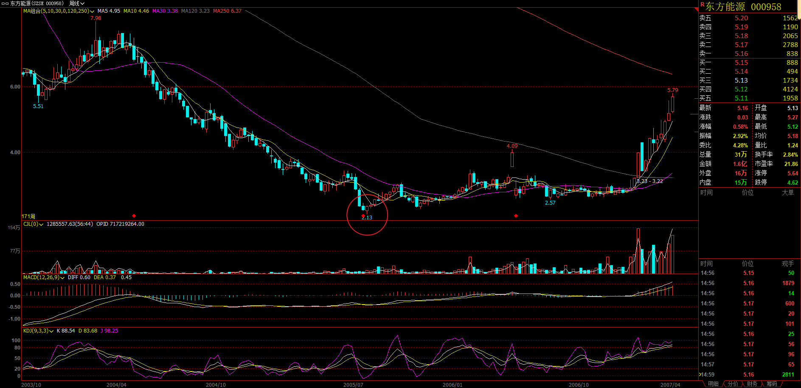
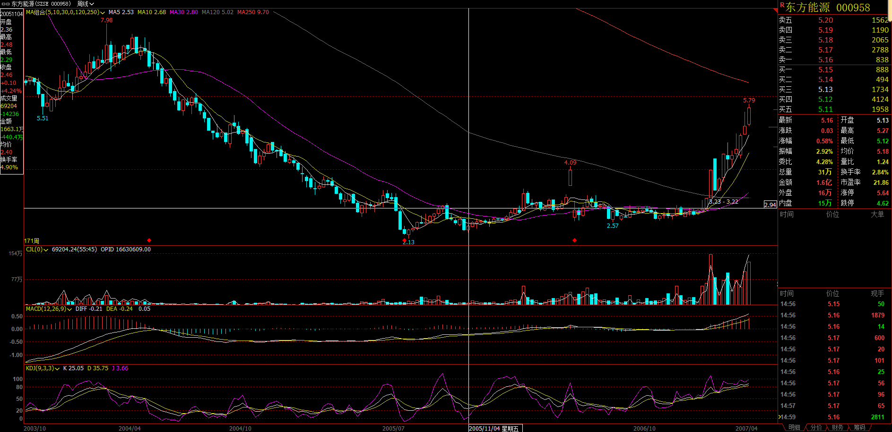
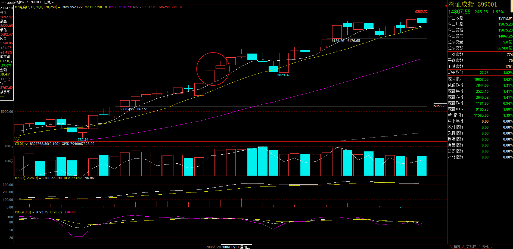

## 逻辑线

两条长短周期的均线可以将走势分类。

均线的关系有三种：飞吻、唇吻、湿吻。

湿吻表现为均线缠绕。

缠绕分为中继和转折。

先不考虑缠绕转折的情况。

对于中继缠绕后的背驰是第一个买点，之后女上位第一次缠绕不新低是第二个买点。

越来越高或越来越低的缠绕为趋势，横盘缠绕为盘整。

在趋势中或趋势之间可以通过均线面积大小比较力度，力度变小为背驰。

高级别的趋势的一段，可能是低级别的一整个趋势，这是级别的同构性关系。

## 051.教你炒股票7：给赚了指数亏了钱的一些忠告

* 市场需要有热度，才有机会。

* 指数股上涨是牛市第一阶段。

* 放量突破上市首日最高价的新股。

* 放量突破年线后缩量回调年线的老股。

* 中线如果连30天线都没破，证明走势很强。基本是5周线。

* 背驰是正常情况，对于火爆也是可以以2卖的形式结束行情的。

* 避开大的回档，借回档踏准轮动节奏。

* 长期胜利，一定要坚持用最小风险换取最大利润。

## 054.教你炒股票8：投资如选面首，G点为中心，拒绝ED男！

* 各种面往往被拿来忽悠人，面最终都是为了一个好里子，那什么是好里子？

* 没有必然的什么情况就涨，什么情况就跌。但也依然得从各种情况入手。

* 人只要介入这种投资游戏，其介入就必然要以某种方式进行，相应地，其后必然有着某种理论、信念的基础。某种理论、信念就可以发挥作用，比如均线，金死叉，加减息，不同的人信的不同，选择以不同的信念为操作依据，这些依据就会在现实中发挥着作用。所以，了解这些依据，就有助于观察这些依据对缠论结构的影响。

* 投资市场最重要的指标就是热度。

* 搞250天线以上的，即年线。

* 周线上成交量压力线的突破。

* 资金量不大且短线技术还可以的，可以把250天线改成70天线、35天线，甚至改为30分钟图里的相应均线。

* 对新股，可以用上市第一日的最高价作为标准

* 识别各种空头陷阱，利用空头陷阱介入是一个很好的方法，这种方法比较专业点，以后专门说。

* 一旦被搞的分类原则确定，就一定要严格遵守“只搞能搞的”原则。

* 这样一个简单的原则，绝大多数的人即使知道也不能遵守。

* 人的贪婪使得人有一种企图占有所有机会的冲动

* 能搞的选出来了，而接下来，就要防止其“早泄”。

* 无论是选一个好面首还是一个好股票，把“早泄”的一类给筛出去可是最重要也是最困难的一步，很多所谓的高手，就死在这一步上。

* 先把技术学好，否则死都不知道怎么死的就不好了。

* 不要用你的想象代替现实。

* 在投资市场中，一次的跌倒，终生都追不回来，基本只能在后面跟着玩了。而在后面跟着玩，怎么都算不了牛人。

* 要长期胜利，就一定要坚持用最小风险换取最大利润，风险是第一的，这里没有什么高低之分。

## 056.教你炒股票9：甄别“早泄”男的数学原则！

* 所有预期上涨后的买入都要考虑好如何退出。

* 走势完全可以很有劲，预期趋势，但是走成一个盘整就结束了，甚至就3段背驰技术了，更甚至上转转2卖就结束了，只能靠资金管理解决。

* 任何一个孤立的程序都不会有太低的“早泄”率。

* 不相事件干概率用乘法算。

* 三个互相独立程序的交易系统：

  技术指标，都单纯涉及价量的输入而来。一个带均线和成交量的K线图，比任何技术指标都有意义。

  比价关系，比价关系的变动，也可以构成一个买卖系统，这个买卖系统是和市场资金的流向相关。

  对市场的参与者、对人性有更多的了解才可能精通的基本面。
  
* 银行是红旗，只要看着红旗还在打，各根据地就可以继续轮动大干了。

## 057.《论语》详解：给所有曲解孔子的人（34）

* “察”，无所谓好恶，而带着各种好恶去“察”，就无所谓“察”了，只不过继续“我本位”逻辑的把戏。
* “察”就要摈弃一切好恶，当下直观，这样才有可能进而“远虑”。
* 无所好恶的当下直观观察众的好恶。
* 介入股票最好在均线粘合时。
* 如果是短线，第一、二次冲击年线都是最好的短差机会。
* 如果是希望中线持有的，就耐心等待年线和半年线的突破。
* 如果是短线，一定要在均线粘合时介入，这样就不用浪费时间。
* 120，250线的有重要的支撑压力作用。
* 个股，先站稳年线再说。
* 只要知道行情正在展开，考虑有多大潜力，什么时候是顶底，是多少点都是害人的想法。
* 中线的顶不是一天炼成的，只有筑顶一顶时间后才会出现那种类型的大阴线。
* 上升途中的大阴线，只会引发多头更凶猛的反扑。
* 巨量大阴线构造顶部的下跌反抽中介入，这种情况实际上是买在了2卖。
* 不要对有规律的走势产生思维定式，人经常就是这样被杀的。

## 058.教你炒股票10：2005年6月，本ID为何时隔四年后重看股票

* 本币历史性升值所带来历史性牛市曾被太多国家所经历。
* 不要有好恶而无察。
* “只搞能搞的”，而不是“只搞喜欢的”。能搞是需要“察”而得之，不是靠喜好厌恶而来的。
* N只能有限地给予一个固定的能搞对象，有N1，就要有N2，这样才能生生不息，才能风生水起。
* 在4N9的任何一段N中，让每一个细节深入你心，成为本能的反应。
* 察某一段走势之间的细节，以此察这段走势。
* 使用未复权查看走势。
* 一线涨完二线涨，二线涨完三线涨，把握这个节奏。
* 刚突破年线回试时买，安全有效。
* 不要预测任何消息的影响，而是要仔细观察市场对消息的所有消息的综合反应，也就是市场的走势本身。消息是来测试市场体质的，而不是用来预测的。
* 120周线，中线生命线。
* 把一些基础的东西变成自己的一种本能反应，例如建立符合自己的有效的操作程序，这是初学者最基本的东西。
* 养成好习惯是投资第一重要的事情。别怕机会都没了，市场中永远有机会，关键是有没有发现和把握机会的能力，而这种能力的基础是一套好的操作习惯，这样所有的操作都没有什么两难的地方，都很简单。

## 060.经典回放：G股就是G点，市场的原理和性的原理是一样的

* 牛市需要牛股作为引爆点。
* 第一阶段：成分股；第二阶段：成长股；第三阶段：重组股。
* 市场兴奋了，一切都好办；市场没感觉，一切都瞎掰。
* 缩量回调用来确认突破。
* 投资最重要的一条就是用来投资的钱必须是多余的，可以长期利用的。
* 筹码集中度，有些散户拿的太多的，就只能继续折腾了，散户不敢拿的，都变庄股，走起来就没谱了。

## 061.那一夜，他的体液喷了我一身（十五、十六）

* > 缠中说禅 2006-11-28 12:15:13 
  >
  > 今天走势很正常，关键还是这两天一直强调的5日线，目前最稳妥的走法就是让5日线和10日线来个接吻的前戏，然后再次高潮。但必须再次指出，这次高潮过后，相应的不应期要比这次长。 
  
  吻后再高潮，就是背驰，多头陷阱，所以不应期要比这次长。

* 第一次提到吻的概念。

* 不要在所有均线都向下发散时买股票。

* 此篇根据描述看，此篇湿吻的定义是K线跌破10日线。

### 062.教你炒股票11：不会吻，无以高潮！

* >技术分析可说的东西太多了，这指标那指标，如何应用，关键就是上面所说的分类问题。任何技术指标，只是把市场进行完全分类后指出在这个技术指标的视角下，什么是能搞的，什么是不能搞的，如此而已。至于这个指标对应的情况是否百分百反映在实际的走势上，这个问题的答案肯定是否定的，否则所有的人都可以按照这指标操作，哪里还有亏钱的人？然而，只要站在纯粹分类的角度考察技术指标，那么，技术指标就会发挥他最大的威力。

  站在技术指标的角度分类和站在分类的角度考察技术指标。

* 对于超超短线，在1分钟上显示强势就可以介入了，特别在有T+0的情况下。

* 任何技术指标系统的应用，首要的选择标准都和应用的资金量和操作时间有关，脱离了这个，任何继续的讨论都没有意义。

* 任何的行情转折，在很大几率上都是由湿吻引发的，这里分两种情况：一种是先湿吻，然后按原趋势来一个大的高潮，制造一个陷阱，再转折；另一种，反复湿吻，构造一个转折性箱型，其后的高潮，就是体位的转化了。

* 震荡区间不断缩小，湿吻不断，高潮快到了，先关注体位吧。即，湿吻之后是男上位还是女上位。

* 关键要拿图形对照缠师所讲，化为自己的理解，并通过熟练形成直觉。

* 对箱型的走势，一定要在箱底买，这样止损也简单。

### 063.《论语》详解：给所有曲解孔子的人（36）

* 不要因为涨得太多而抛股票，只有一种情况需要抛股票：就是这股票走弱了。

* 30天线有效跌破前应该一路中线持有，除非出现放量加速上涨的情况。

* >一只股票走弱的标志是什么呢？破5日均线？

  不要习惯于这种机械化的思维。一切都根据实际情况来的。

### 064.教你炒股票12：一吻何能消魂？

* 前面说的关于吻得知识，目的是为了干而不看。

* 设置一个系统，能描述不同的风险等级。使风险在该系统中，有位次。

* 任何投资操作，都演化成这样一个简单的数学问题：N种完全分类的风险情况，对应三种（买、卖、持有）操作的选择。

* 5日线，10日线均线系统：

  5在10上，女上位，上涨；

  10在5上，男上位，下跌；

  5、10缠绕，中继或转折。

  在缠绕完成后介入，值得介入的两种情况：男上位转折，女上位中继，即下跌转折和上涨中继。

* 对于任种走势，首要判断的是体位：男上位还是女上位。

* 如果是女上位的情况，一旦出现缠绕，唯一需要应付的就是这缠绕究竟是中继还是转折。

* 准确率足够高的判断：

  1.女上位趋势出现的第一次缠绕是中继的可能性极大，如果是第三、四次出现，这个缠绕是转折的可能性就会加大；

  2.出现第一次缠绕前，5日线的走势必须是十分有力的，不能是疲软的玩意，这样缠绕极大可能是中继，其后至少会有一次上升的过程出现；

  3.缠绕出现前的成交量不能放得过大，一旦过大，骗线出现的几率就会大大增加，如果量突然放太大而又萎缩过快，一般即使没有骗线，缠绕的时间也会增加，而且成交量也会现在两次收缩的情况。

  

* 女上位选择第一次出现缠绕的中继情况。

* 男上位寻找最后一次缠绕的转折情况，其后如果出现急跌却背驰，那是最佳的买入时机。

  一般，男上位后第一次缠绕肯定不是，从第二次开始都有可能。

  如何判断，最有力的就是利用好背驰制造的空头陷阱。

* 利用均线构成的买卖系统，首先要利用男上位最后一次缠绕后背弛构成的空头陷阱抄底进入，这是第一个值得买入的位置，而第二个值得买入或加码的位置，就是女上位后第一次缠绕形成的低位。

  站在该系统下，这两个买点的风险是最小的，准确地说，收益和风险之比是最大的，也是唯一值得买入的两个点。

  并不是说这两个买点一定没有风险，其风险在于：对于第一个买点，把中继判断为转折，把背弛判断错了；对于第二个买点，把转折判断成中继。

  这里的风险很大程度和操作的熟练度有关，对于高手来说，判断的准确率要高多了

  如何成为高手，关键一点还是要多干、看参与，形成一种直觉。

  无论高手还是低手，买点的原则是不变的，唯一能高低的地方只是这个中继和转折以及背弛的判断。

  中继、转折、背驰的判断。

* 任何不在这两个买点买入的行为都是不可以原谅的，因为这是原则的错误，而不是高低的区别，如果你选择了这个买卖系统，就一定要按照这个原则了。

  这点，对于短线依然有效，只是把日线改为分钟线就可以了。的均线的参数可以根本资金量等情况给予调节，资金量越大，参数也相应越大，这要自己去好好摸索了。

  一旦买入，就一直持有等待第一个卖点，也就是女上位缠绕后出现背弛以及第二个卖点也就是变成男上位的第一个缠绕高点把东西卖了，这样就完成一个完整的操作。

* 买的时候一般最好在第二个买点，而卖尽量在第一个卖点，这是买和卖不同的地方。

* 

  目前为止，均线系统，第一买点不一定是最低点，41.08前面就还有一个37.68，不过这是因为除权造成的。

  且根据图形，缠师对均线缠绕的描述包括横盘缠绕。

* 

  9月14日，价格43.2，为女上位的第一次缠绕下跌形成的第二买点。

* 目前只讲了事后怎么看走势，先理解这个结构。

* 即使是短线，10日线不有效跌破就继续持有等待第一个卖点，也就是缠绕后出现背弛的出现。第二个卖点就是变成男上位的第一个缠绕的高点

* 
  
  周线图，7月22日，2.13，男上位缠绕后下跌背驰。

  

  周线图，11月4日，2.29，女上位后第一次缠绕，不新低。

  中线用周线，短线可以参照日线的该种方法操作。

* 并不是说除了这两个点就不能买，但那要承受更大的风险，而要长期成功，就要尽量学会把风险控制到最低。

* 

  今天深圳成指留下的缺口十分重要，如果很快回补，则技术上发出不好的信号。

  由于11月是巨阳，12月上冲后出现大幅震荡不可避免，这必须要清醒。 

* 把基本面当上帝和把技术当上帝一样可笑。

### 066.教你炒股票13：不带套的操作不是好操作！

* 缠论从来没有不止损，只是不根据亏损多少而止损，而是根据还能不能搞而止损。

  盈亏多少不是先验的，缠论只能解决当下正在干什么，为不能解决会涨跌到何时？何价？所以缠论怎么能预先知道盈亏多少呢？

* 但更重要的是，任何的介入，都有一个主动的防护加入其中，这个防护就是从一旦变为不能搞，就立刻从买入程序中此退出，这个防护的启动是和任何盈亏无关的，只和当下的走势有关。

* 对于第一个买点，一旦上涨时依然出现男上位的缠绕，那么一定要退出，为什么？因为第一个买点买入的基础在于男上位最后一个缠绕后出现背驰，而现在又出现男上位的缠绕，意味着前面引导买入程序启动的缠绕并不是最后一个缠绕，也就是程序判断上出现问题，因此必须退出。

* 对于上一章所说的第二个买点，一旦该缠绕中出现跌破前面男上位的最低位，就意味着买入程序出现问题，必须在任何一个反弹中把股票出清，在这种情况下，不排除后面出现上涨，但理由如上，任何操作，没有百分百准确的，一旦出现特殊情况，一定要先退出来，这是在投资生涯中能长期存活的最重要一点。

* 别关心点位，特别对于散户来说，任何一个级别大点的调整都应该避开，没必要参与。行情走到10000点，对于散户来说，完全可以分解成很多段来操作，所以对最终点位的预测其实意义不大。 

* 短线判断大盘调整的一个最简单方法就是深沪指数的背离,一旦出现,调整或至少是震荡将很快发生。

* 转折点不是看均线，而是看符合要求的缠绕时的K线。

* 如果是超短5分钟就足够了。

### 067.教你炒股票14：喝茅台的高潮程序！

看全文

### 068.《论语》详解：给所有曲解孔子的人（38）

看全文

### 071.教你炒股票15：没有趋势，没有背驰。
看全文

### 076.教你炒股票16：中小资金的高效买卖法。
看全文，特别重要！

