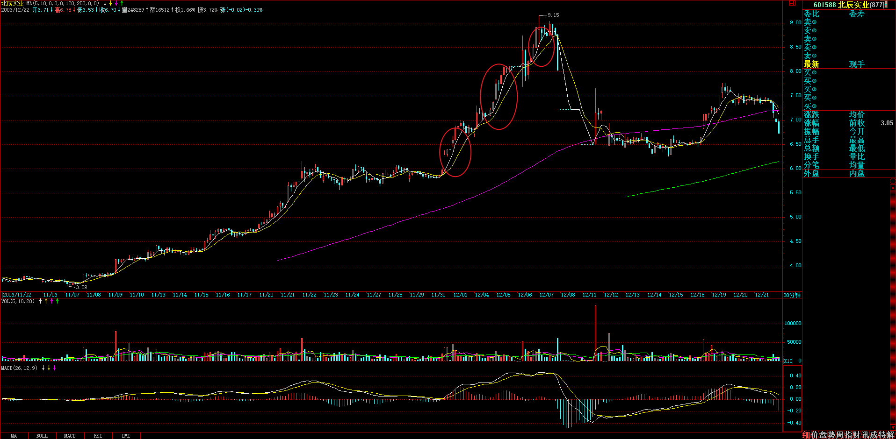
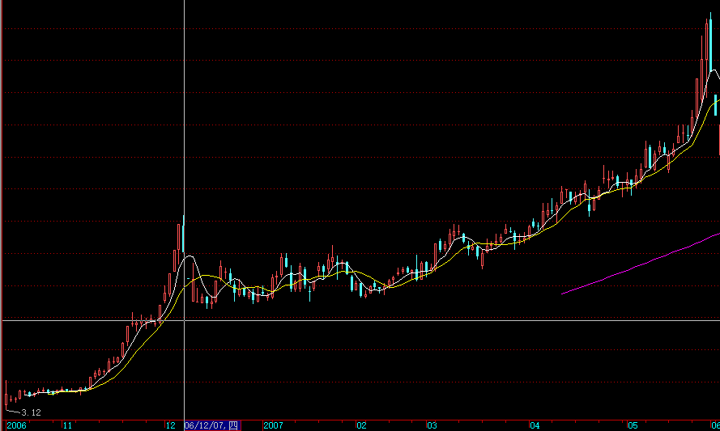

教你炒股票15：没有趋势，没有背驰。(2006-12-08 11:55:57) 

> 这课之前没有定义上涨、下跌、盘整。

有人很关心诸如庄家、主力之类的事情，但散户、庄家的位次分野这类事情不过是市场之“不患”下的“患”， 对本ID所解《论语》熟悉的，对此都很容易理解。有些东西是超越散户、庄家的位次分野的，这是市场之根，把握了，所谓散户、庄家的位次分野就成了笑话。如果真喜欢听有关庄家的逸事、秘闻，以后有空本ID可以说点，而且还可以告诉你如何阻击、搞死庄家，这一点，环视国内，没有比本ID更有经验的了。

> 走势的三种分类，是超越散户、庄家的位次分野的，这是市场之根。

对于市场走势，有一个是“不患”的，就是走势的三种分类：上涨、下跌、盘整。所有走势都可以分解成这三种情况。这是一个最简单的道理，而这才是市场分析唯一值得依靠的基础。很多人往往忽视最简单的东西，去搞那些虚头八脑的玩意。而无论你是主力、散户、庄家，都逃不过这三种分类所交织成的走势。

那么，何谓上涨、下跌、盘整？下面给出一个定义。首先必须明确的是，所有上涨、下跌、盘整都建立在一定的周期图表上，例如在日线上的盘整，在30分钟线上可能就是上涨或下跌，因此，一定的图表是判断的基础，而图表的选择，与上面所说交易系统的选择是一致的，相关于你的资金、性格、操作风格等。

> 目前为止，所有上涨、下跌、盘整都建立在一定的周期图表上。

上涨：最近一个高点比前一高点高，且最近一个低点比前一低点高。

下跌：最近一个高点比前一高点低，且最近一个低点比前一低点低。

盘整：最近一个高点比前一高点高，且最近一个低点比前一低点低；或者最近一个高点比前一高点低，且最近一个低点比前一低点高。

操作的关键不是定义，而是如何充分理解定义而使得操作有一个坚固的基础。其中的困难在于如何去把握高点和低点，因为高点、低点是有其级别的，在30分钟图上看到的高点，可能在周线图上什么都没看到。为此，必须要均线系统来过滤，也就是前面常说的“吻”的概念，只有在“吻”前后出现的高、低点才有意义。

> 操作的关键不是定义，而是如何充分理解定义而使得操作有一个坚固的基础。
>
> 其中的困难在于如何去把握高点和低点，因为高点、低点是有其级别的，在30分钟图上看到的高点，可能在周线图上什么都没看到。
>
> 必须要均线系统来过滤，只有在“吻”前后出现的高、低点才有意义。

这里，首先要搞清楚“吻”是怎样产生的。如果一个走势，连短线均线都不能突破，那期间出现的高、低点，肯定只是低级别图表上的，在本级别图表上没有意义。当走势突破短期均线却不能突破长期均线，就会形成“飞吻”；当走势突破长期均线马上形成陷阱，就会形成“唇吻”；当走势突破长期均线出现一定的反复，就会形成“湿吻”。由此可见，“吻“的分类是基于对原趋势的反抗程度，“飞吻”是基本没有任何反抗力，“唇吻”的力度也一般，而“湿吻”，就意味着力度有了足够的强度，而一切的转折，基本都是从“湿吻”开始的。

转折，一般只有两种：一、“湿吻”后继续原趋势形成陷阱后回头制造出转折；二、出现盘整，以时间换空间地形成转折。第二种情况暂且不说，第一种情况，最大的标志就是所谓的“背驰”了。必须注意：没有趋势，没有背驰。在盘整中是无所谓“背驰”的，这点是必须特别明确的。还有一点是必须注意的，这里的所有判断都只关系到两条均线与走势，和任何技术指标都无关。

> 转折，一般只有两种：一、“湿吻”后继续原趋势形成陷阱后回头制造出转折；二、出现盘整，以时间换空间地形成转折。
>
> 有一点是必须注意的，这里的所有判断都只关系到两条均线与走势，和任何技术指标都无关。

如何判断“背驰”？首先定义一个概念，称为缠中说禅趋势力度：前一“吻”的结束与后一“吻”开始由短线均线与长期均线相交所形成的面积。在前后两个同向趋势中,当缠中说禅趋势力度比上一次缠中说禅趋势力度要弱，就形成“背驰”。按这个定义，是最稳妥的办法，但唯一的缺点是必须等再次接吻后才能判断，这时候，走势离真正的转折点会已经有一点距离了。如何解决这个问题：第一种方法，看低一级别的图，从中按该种办法找出相应的转折点。这样和真正的低点基本没有太大的距离。

还有一种方法，技巧比较高，首先再定义一个概念，称为缠中说禅趋势平均力度：当下与前一“吻”的结束时短线均线与长期均线形成的面积除以时间。因为这个概念是即时的，马上就可以判断当下的缠中说禅趋势平均力度与前一次缠中说禅趋势平均力度的强弱对比，一旦这次比上次弱，就可以判断“背驰”即将形成，然后再根据短线均线与长期均线的距离，一旦延伸长度缩短，就意味着真正的低部马上形成。按这种方法，真正的转折点基本就可以完全同时地抓住。但有一个缺陷，就是风险稍微大点，且需要的技巧要高点，对市场的感觉要好点。

纯粹的两条均线的K线图，就足以应付最复杂的市场走势了。当然，如果没有这样的看图能力，可以参照一下技术指标，例如MACD等，关于各技术指标的应用，以后会陆续说到。

------
```
缠中说禅 2006-12-08 12:11:24 
最近新浪的系统很有问题,今天怎么都排不好版.各位将就着看吧. 
```
```
缠中说禅 2006-12-08 12:18:49 
最终搞好了,字体大了,这新浪人太多了,系统太不稳定. 
```
```
缠中说禅 2006-12-08 12:19:59 

[匿名] 老老没用 
2006-12-08 12:16:56 
说的好啊！把精髓性的东西说出来了。慢慢品味，学习实践，变成自己直觉性的东西。那就是大成啊！ 
=============
这就好 
```
```
缠中说禅 2006-12-08 12:20:46 

[匿名] iris 
2006-12-08 12:16:47 
楼主真乃神人也，疯狂学习中。可惜我是新手，看起来比较费劲 
===========
慢慢来,有的是时间\机会. 
```
```
缠中说禅 2006-12-08 12:22:33 

小明 
2006-12-08 12:06:19 
我来迟了，报个道。
LZ真的不再说大盘了？ 
========
暂时不说,等哪天大家不那么鼓噪再说.
有些事情,各位不需要太了解,有些事情,乱猜想也没用. 
```
```
缠中说禅 2006-12-08 12:35:56 

[匿名] 小溪 
2006-12-08 12:32:05 
缠JJ我的股票600196没出现吻已经跌去一大截了等吻出来那不是都跌没了55555555我咋办呢? 
===========
你的理解错误.你好好品味这句话:
首先必须明确的是，所有上涨、下跌、盘整都建立在一定的周期图表上，例如在日线上的盘整，在30分钟线上可能就是上涨或下跌， 
```
```
缠中说禅 2006-12-08 12:39:24 

[匿名] 中间体 
2006-12-08 12:31:36 
就是说形成趋势后再谈背驰, 背驰的力度是根据面积判断. 但是不是有可能出现背驰后还会有第二个背驰呢??? 请缠姐回答. 
============
上面说600196的那位,必须也要如此理解:形成趋势后再谈背驰.
对于一段趋势来说背驰只会一次.里面还有一个微妙的东西,过两天说. 
```
> 对于一段趋势来说背驰只会一次.里面还有一个微妙的东西,过两天说。

```
缠中说禅 2006-12-08 12:40:34 

任我行 
2006-12-08 12:37:19 
楼主真是一大伟人。无私的把自己的技术向社会奉献了
我喜欢短线。楼主能不能多说点短线操作方法。还有要怎样才能知一个股票有没有主力。就好象这几天走强的600050来事把要怎样发现他要拉升 
============
长线短线的技术基础是一样的,只是看的图表不同,最短线的就看1分钟图,一般看5分钟或30分钟图. 
```
> 长线短线的技术基础是一样的,只是看的图表不同,最短线的就看1分钟图,一般看5分钟或30分钟图. 

```
缠中说禅 2006-12-08 12:41:16 

[匿名] 中间体 
2006-12-08 12:40:02 
一定是二个相邻的面积比较吗??? 
===========
是,要多看图,面积这东西,目测就可以知道,不用什么指标. 
```
```
缠中说禅 2006-12-08 12:44:09 

[匿名] 外科医生 
2006-12-08 12:38:27 
如向北辰股份那种走势,如何判断其卖出信号,现在如何处理为最佳方案(首先强调,我并没有该股,只是以此举例而已)?谢谢?
。。。。。。。。。。
昨天下午2点发生背迟，卖出信号 
===========
对,该股30分钟图上的辈驰什么明显.对这种短线走势特别猛的,如果资金不太大的,不能看日线,那反应太慢,看30分钟线足以. 
```
> 

```
缠中说禅 2006-12-08 12:45:05 

[匿名] 半部论语治天下 
2006-12-08 12:43:45 
有个问题，均线交叉形成的面积是不规则的，如何计算？ 
=============
形成趋势的才算面积,否则不断缠绕的,是盘整.这必须搞清楚. 
```
> 形成趋势的才算面积,否则不断缠绕的,是盘整.这必须搞清楚. 
>
> 横向不断缠绕是盘整，比较的是非横向不断缠绕的缠绕的面积。

```
缠中说禅 2006-12-08 12:47:17 

[匿名] nn 
2006-12-08 12:29:25 
首先感谢楼主无私教诲,但理论性较强,年龄老了,还需要漫漫领会,有一点不明,比如向北辰股份那种走势,如何判断其卖出信号,现在如何处理为最佳方案(首先强调,我并没有该股,只是以此举例而已)?谢谢? 
=============
这种短线太猛的,看30分钟图,卖点十分清楚.目前如果没走也不用怕,反抽会很猛烈的,就等着吧. 
```
```
罗锅： 2006-12-08 12:50:09 

[匿名] 射男哥哥 
2006-12-08 12:47:59 
哥哥我查了一下,9月30日前拿到水井坊的股票的个人有:蒋红浪和李桂香等人.莫非以上两人中有缠妹妹吗? 

BBBBBBBBBBBBBBBBBBBBB

你脑子进水啦????????????????????数学妹妹就因为你这种人昨天公告不说具体个股的!!!!!!!!!!! 
```
```
缠中说禅 2006-12-08 12:52:04 

心禅 
2006-12-08 12:47:20 
“禅主”，你好，我来了，稍晚点，
卖点的疑惑：
从个股看，第一卖点并未出现，可大盘的调整下跌必使其下跌，此种情况如何回避？是不考虑大盘的下跌继续持有吗？ 
============
这种情况根本不会出现,关键是图表选择的问题,像北辰实业这次,在日线上没有第一类卖点,在30分钟线上就十分明显,关键是你如何选择. 
```
> 日线：
>
> 

```
缠中说禅 2006-12-08 12:56:14 

公告一条缠中说缠定理

任何的上涨转折都是由某级别的第一类卖点构成的;任何的下跌转折都是由某级别的第一类买点构成的.

注意版权. 
```
> 某级别，不一定是次级别。

```
缠中说禅 2006-12-08 12:58:41 

[匿名] 中间体 
2006-12-08 12:56:34 
缠姐没给出结论啊, 面积比越大越好还是越小越好啊, 应该是小吧.  
==========
上面写的很清楚,比前面的小就可以了.好好研究这句话

如何判断“背驰”？首先定义一个概念，称为缠中说禅趋势力度：前一“吻”的结束与后一“吻”开始由短线均线与长期均线相交所形成的面积。当缠中说禅趋势力度比上一次缠中说禅趋势力度要弱，形成“背驰”。 
```
```
缠中说禅 2006-12-08 12:59:40 
开盘了,先下.再见. 
```
```
罗锅： 2006-12-08 13:01:01 

[匿名] 射男哥哥 
2006-12-08 12:57:34 
楼主才情古今少见!反正书就要快出版了!我等男猿人要一识妹妹真身也是人之常情!罗锅不要反映如此强烈!否则,我又要以为你和楼主是穿一条裤子了!你是求之不得,可把楼主给玷污了! 

BBBBBBBBBBBBBBBBBBBBBBB

还嘴硬????????????????打!!!!!!!!!!!!!!!!!!!!!!! 
```
```
超大JJ： 2006-12-08 13:59:19 

而且还可以告诉你如何阻击、搞死庄家，这一点，环视国内，没有比本ID更有经验的了。 
----------
太牛了 
```
```
缠中说禅 2006-12-08 15:04:56 

小明 
2006-12-08 14:55:02 
[匿名] 庸人 

2006-12-08 14:32:52 
世上本无事，庸人自扰之。
一个小小的北辰实业，就能够让大盘尸横遍野。所有的繁荣只不过是虚幻，过眼烟云而已。 
=======================
自称庸人的人水平的确不怎么样！
缠mm曾经说过，不要跟着那些小资金后面玩，要多看看大资金在干什么。你看看几大龙头股哪个不是筑成了双重顶？
而北辰只是个导火索而已，just一个引线，懂吗？ 
============
干什么都要有预见性,这调整,1日已经提前提醒了,不相应操作是心态问题,被市场迷惑了.繁荣只不过是虚幻,不繁荣也只不过是虚幻,不明白这点,总是一边去想,是不可能成为好的操作者的.

好的操作者就是以幻制幻,幻中取利.

大盘跌,意味着机会又来了，应该高兴才对.当然,满仓的就没办法了. 
```
```
缠中说禅 2006-12-08 15:06:26 

[匿名] 中间体 
2006-12-08 12:40:02 
一定是二个相邻的面积比较吗??? 
===========
是,要多看图,面积这东西,目测就可以知道,不用什么指标.

中间有盘整区的话, 是否可跳过盘整区与前面比较???
==============
盘整不是趋势,当然不算. 
```
> 一定是二个相邻的面积比较吗??? 
> 是,要多看图,面积这东西,目测就可以知道,不用什么指标.
>
> 中间有盘整区的话, 是否可跳过盘整区与前面比较???
> 盘整不是趋势,当然不算. 

```
缠中说禅 2006-12-08 15:07:27 
本ID有应酬先下了,各位慢看,再见. 
```
```
超大JJ： 2006-12-08 22:44:27 
牛女 
```
```
罗锅： 2006-12-08 23:31:25 

[匿名] 糖非饵 
2006-12-08 23:27:30 
博主，关键时刻到来的时候你反倒不对大盘走势发表意见了，不厚道！或者是你自己也没意见了？ 

BBBBBBBBBBBBBBBBBBB
数学妹妹怎么没意见啦????????????数学妹妹1日就告诉你要本月要大幅震荡,周三中午还特别提示了一次,这还不够吗???????????????? 
```
```
罗锅： 2006-12-08 23:32:57 
数学妹妹口头上说不讲大盘，其实还是讲了,这不就是吗??????????

缠中说禅 
2006-12-08 15:04:56 

小明 
2006-12-08 14:55:02 
[匿名] 庸人 

2006-12-08 14:32:52 
世上本无事，庸人自扰之。
一个小小的北辰实业，就能够让大盘尸横遍野。所有的繁荣只不过是虚幻，过眼烟云而已。 
=======================
自称庸人的人水平的确不怎么样！
缠mm曾经说过，不要跟着那些小资金后面玩，要多看看大资金在干什么。你看看几大龙头股哪个不是筑成了双重顶？
而北辰只是个导火索而已，just一个引线，懂吗？ 
============
干什么都要有预见性,这调整,1日已经提前提醒了,不相应操作是心态问题,被市场迷惑了.繁荣只不过是虚幻,不繁荣也只不过是虚幻,不明白这点,总是一边去想,是不可能成为好的操作者的.

好的操作者就是以幻制幻,幻中取利.

大盘跌,意味着机会又来了，应该高兴才对.当然,满仓的就没办法了 
```