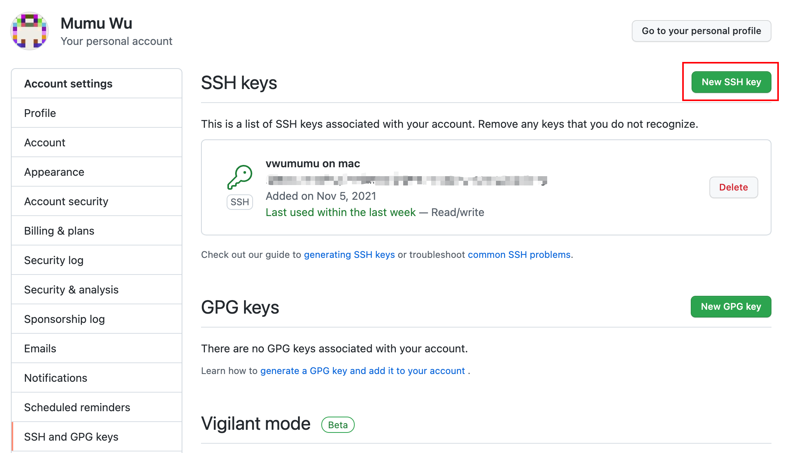
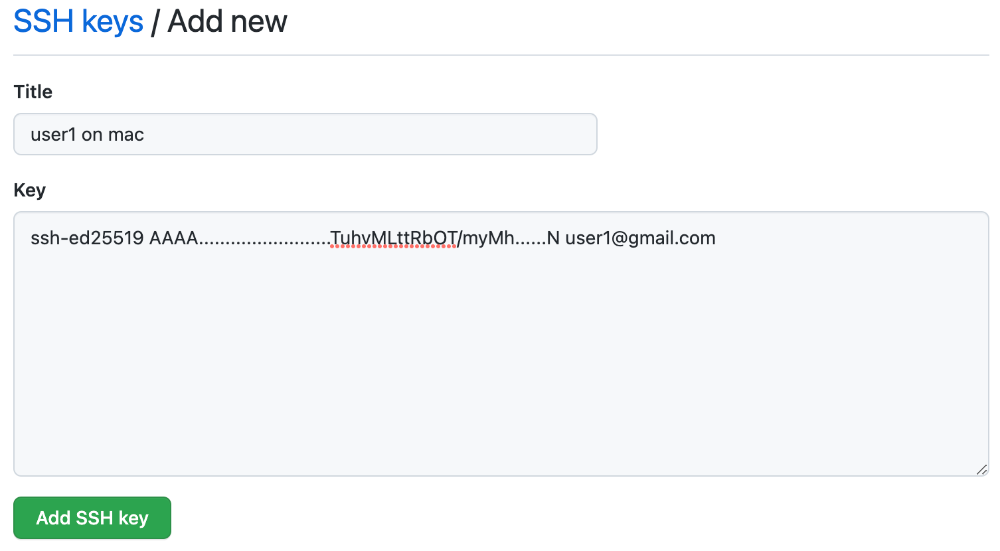

我们可能会有一种需求，在同一台电脑上，通过ssh的验证方式，对不同的Git仓库，使用不同的Git账号管理。

比如：
* 同一台电脑，使用一个公司Gitlab账号管理公司的仓库，还要使用一个个人Github账号管理自己的Github仓库；
* 同一台电脑，使用两个不同的Github账号分别管理两个Github账号中的仓库。

以两个不同的Github账号，操作系统MAC OS为例，我们需要以下的步骤：

## 1.为不同的Github账号分别创建ssh密钥对

在~/.ssh/目录下为不同的Github账号分别创建ssh密钥对

在Terminal中执行：
```bash
cd ~/.ssh

# 为Github账号：user1创建ssh密钥对
ssh-keygen -t ed25519 -C <'user1@gmail.com'>

# Generating public/private ed25519 key pair.
# Enter file in which to save the key (/Users/vwumumu/.ssh/id_ed25519): user1   //设置密钥文件名
# ......    //后面的选项可以一路回车

# 为Github账号：user2创建ssh密钥对
ssh-keygen -t ed25519 -C <'user2@gmail.com'>

# Generating public/private ed25519 key pair.
# Enter file in which to save the key (/Users/vwumumu/.ssh/id_ed25519): user2   //设置密钥文件名
# ......    //后面的选项可以一路回车
```
> Enter file in which to save the key 为设置密钥对文件名，两个Github账号的密钥文件需要使用不同的文件名

## 2.建立配置文件设置Github账户与ssh key的对应关系

在~/.ssh/目录下新建config文件，内容如下：

```
Host github.com-user1
    HostName github.com
    user user1
    IdentityFile "~/.ssh/user1"
    IdentitiesOnly yes

Host github.com-user2
    HostName github.com
    user user2
    IdentityFile "~/.ssh/user2"
    IdentitiesOnly yes        
```

## 3.添加私钥到本地

在Terminal中执行：
```bash
cd ~/.ssh
ssh-add user1
ssh-add user2
```

## 4.添加公钥到Github

获取前面生成的ssh key的公钥内容：
```bash
cd ~/.ssh
cat user1.pub
# ssh-ed25519 AAAA.........................TuhvMLttRbOT/myMh......N user1@gmail.com
```
将公钥的内容复制，后面会用到。


在Github账号的设置中，找到SSH and GPG keys，点击New SSH key:



将公钥的内容粘贴到Key的文本框中，点击Add SSH key：


用同样的做法，将user2的公钥添加到user2的Github账号内。
至此，完成了Github上公钥的添加。

## 5.测试本地与Github的连通性

在Terminal中：
```bash
ssh -T git@github.com-user1
# Hi user1! You've successfully authenticated, but GitHub does not provide shell access.  //表示user1 ssh 验证成功

ssh -T git@github.com-user2
# Hi user2! You've successfully authenticated, but GitHub does not provide shell access.  //表示user2 ssh 验证成功
```

## 6.为本地Github仓库分别配置相应用户信息

在Terminal中，在user1的本地仓库目录中：
```bash
git config user.name 'user1'
git config user.email 'user1@gmail.com'
```

在Terminal中，在user2的本地仓库目录中：
```bash
git config user.name 'user2'
git config user.email 'user2@gmail.com'
```

## 7.设置git remote origin

因为在前面的config文件中，我们对不同的host设定了不同的名字，因此，对于不同的本地仓库设置remote origin时，就需要使用相应的host名字。

比如：
对于user1仓库：
```
git remote add origin git@github.com-user1:user1/repository.git
```

对于user2仓库：
```
git remote add origin git@github.com-user2:user2/repository.git
```

到这里，在不同的本地仓库中，使用git pull/git push等命令，就会自动使用相应的账户管理相应的仓库了。
